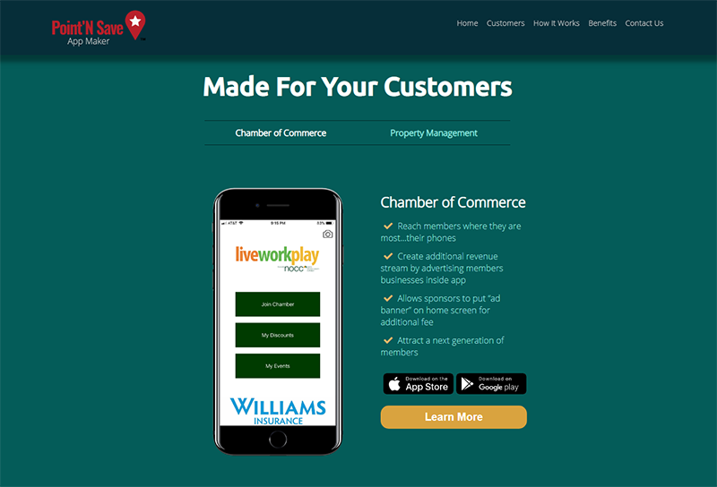

# PointNSave App Maker
This is the repository for a Client website re-do. It's written in HTML/CSS with some basic JavaScript to handle the button navigation, as well as using a Library for smooth scrolling between sections.
I used ParcelJS for project tooling and SASS compiling.
 
Site: 
[PointNSave Website](https://www.pointnsave.com/)
 

